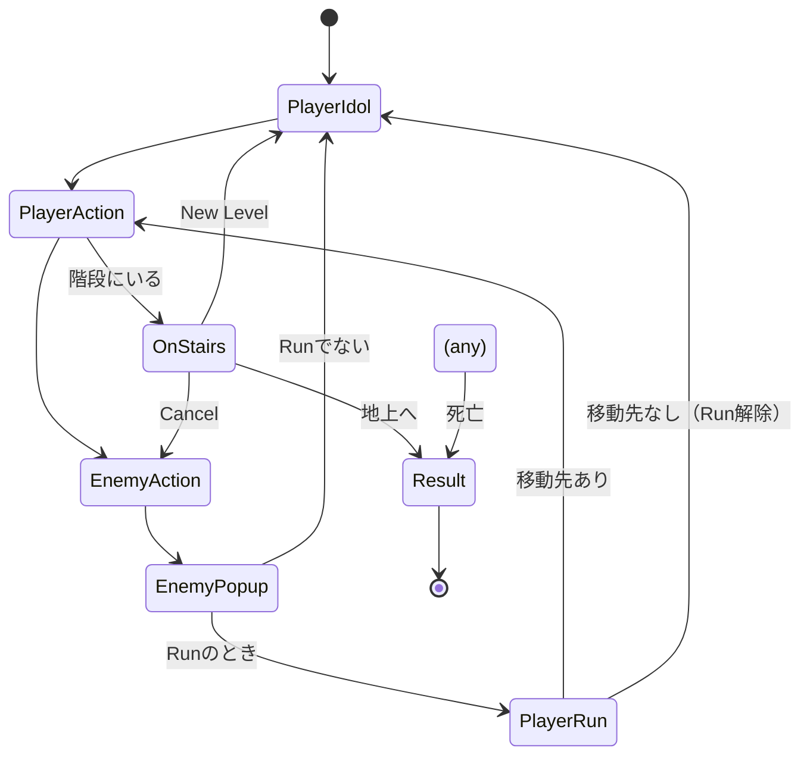
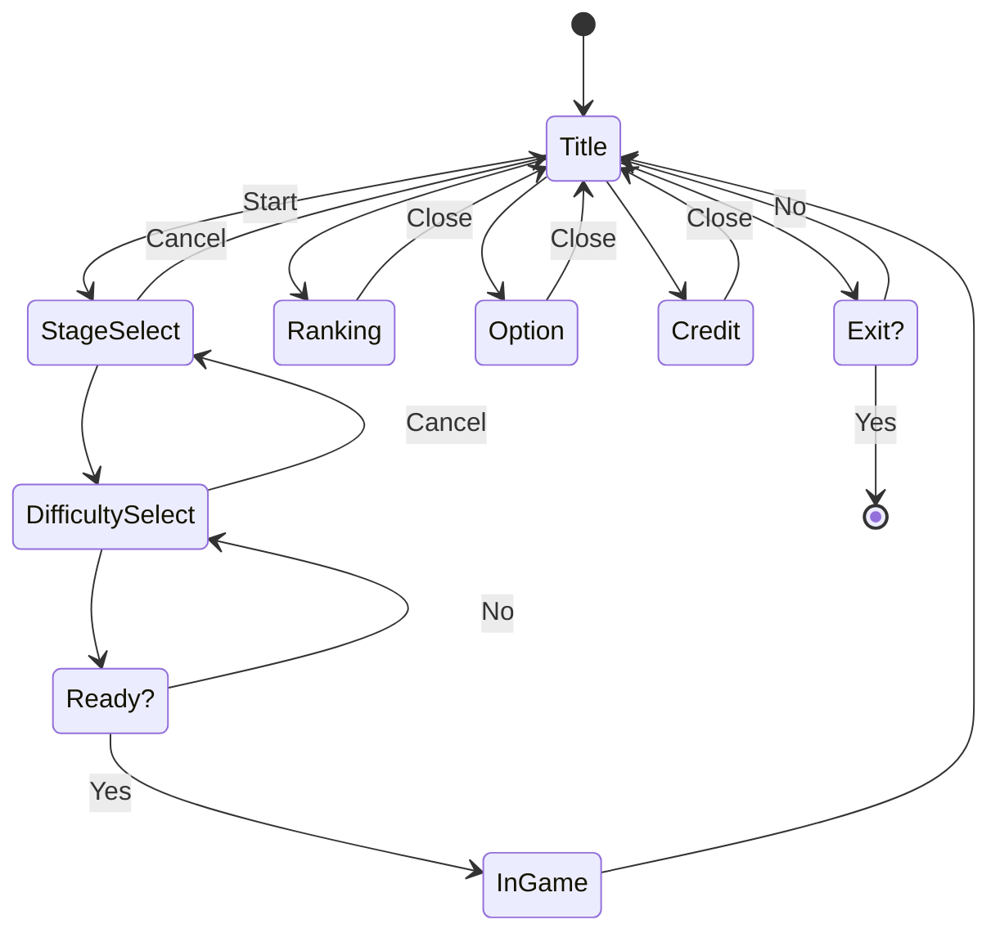

# Roguelike Example

## このリポジトリについて

このリポジトリは、書籍『[Unityバイブル R5夏号](https://www.borndigital.co.jp/book/30830.html)』（ボーンデジタル, 2023）のSECTION 06「ゲームプレイの自動テスト」のサンプルプロジェクトです。

書籍は次のWebサイトから購入できます。

- [Unityバイブル R5夏号（Amazon）](https://amzn.to/3E8bz1M)
- [PDF版 Unityバイブル R5夏号（ボーンデジタル オンラインブックストア）](https://www.borndigital.co.jp/book/30845.html)

プロジェクトは書籍発売以降もメンテナンスされますが、書籍に掲載されているテストコードは極力変更しない方針です。
書籍発売時点のプロジェクトは、tag: [r5smr](https://github.com/nowsprinting/RoguelikeExample/tree/r5smr)を参照してください。

## 注意事項

- Unityエディターでしか動作しません（プレイヤービルドしても動作しません）
- TextMesh Pro Essentialsをトラッキングから外しているので、最初に再生するときにインポートを促すウィンドウが出ます。それに従ってインストールしてください

## ゲームプレイ

### キーボード

- **hjklyubn**キー：移動
- **hjkl**キーと**Control**もしくは**Shift**キー同時押し：高速移動（a.k.a. Run, Dash）
- **Space**キー：進行方向に攻撃、選択肢を決定
- **Escape**キー：選択ダイアログをキャンセル

### ゲームパッド

- **左スティック**：移動
- **左スティック**と**Eastボタン**（ABXYの右側）同時押し：高速移動
- **Southボタン**：進行方向に攻撃、選択肢を決定
- **Eastボタン**：選択ダイアログをキャンセル

## テスト

### カテゴリ

一部のテストには、次の `Category` 属性が定義されています。

- **IgnoreCI** : バッチモードでは動作しないテスト
- **Integration** : 統合テスト。カバー範囲が広く実行時間もかかるもので、開発者の手元でのテスト実行およびPull Requestやデフォルトブランチへのマージ契機での実行から除外し、夜間などに実行するためにカテゴライズしています
- **Validation** : アセット・Scene・Prefab・ScriptableObjectなどのバリデーション。失敗したときの通知先が異なる想定でカテゴライズしています

## 設計資料

### インゲーム（行動ターン）のステート遷移図

### アウトゲームの画面遷移図

## 権利表記・ライセンス

Copyright (c) 2023 Koji Hasegawa

MIT License

### サードパーティ ライセンス

<dl>
  <dt><a href="https://itouhiro.hatenablog.com/entry/20130602/font">PixelMplus</a></dt>
  <dd>Copyright (C) 2002-2013 M+ FONTS PROJECT 
    M+ FONT LICENSE</dd>
  <dt><a href="https://gist.github.com/kgsi/ed2f1c5696a2211c1fd1e1e198c96ee4">kgsi/japanese_full.txt</a></dt>
  <dd>ライセンス未表記</dd>
</dl>
