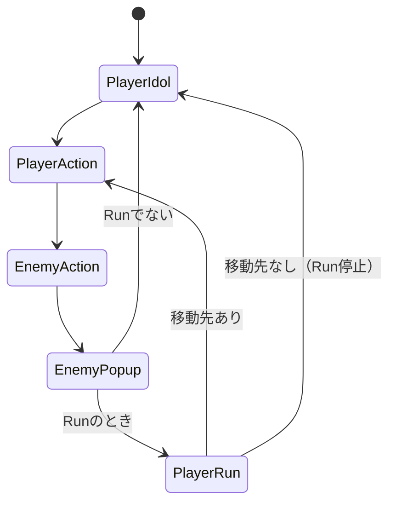

# Roguelike Example

## 注意事項

- Unityエディターでしか動作しません
- TextMesh Pro Essentialsをトラッキングから外しているので、最初にPlayするときにインポートを促すウィンドウが出ます。それに従ってインストールしてください

## ゲームプレイ

### キーボード

- hjklyubnキー：移動
- hjklキー + controlもしくはshiftキー同時押しで高速移動（a.k.a. Run, Dash）
- spaceキー：進行方向に攻撃

### ゲームパッド

- 左スティック：移動
- 左スティック + Southボタン同時押しで高速移動
- Eastボタン：進行方向に攻撃

## テスト

### カテゴリ

一部のテストには、次の `Category` 属性が定義されています。

- **IgnoreCI** : バッチモードでは動作しないテスト
- **Integration** : 統合テスト。カバー範囲が広く実行時間もかかるもので、開発中のユニットテスト実行から除外するためにカテゴライズしています
- **Validation** : アセット・Scene・Prefab・ScriptableObjectなどのバリデーション。失敗したときの通知先が異なる想定でカテゴライズしています

## 設計資料

### 行動ターンのステート遷移図

